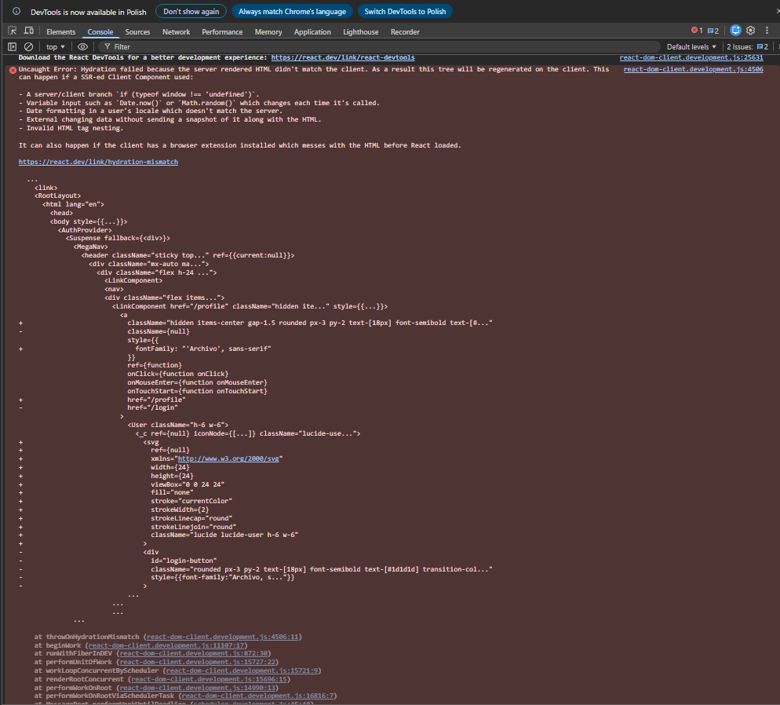

# Test Report

## Navigation bar

**[High]** Below 768px resolution, the main menu disappears, but no alternative menu (e.g., hamburger menu) appears to provide access to "Your parcels", "Lockers & shops", and "Help" tabs.

**[High]** Buttons under "Your parcels", "Lockers & shops", and "Help" tabs are unresponsive. They fail to redirect the user to the subpages responsible for this functionality

**[High]** The "QA Challenges" tab appears to be a development-only feature and should not be visible to the end-user on the production environment.

**[High]** Between 768px and 1024px screen width, the "Profile Name", "Log out", and "Send a parcel" buttons are cut off. This issue occurs between 768px and 885px for unauthenticated users, because the "Profile Name" button is not present.

**[High]** The "Send a parcel" button is duplicated. The one located under "Your parcels" redirects to "#", while the second one leads to "/send-a-parcel" which results in a "404 | This page could not be found" error.

**[Medium]** Cursor behavior is inconsistent. Some buttons show a pointer cursor on hover, while others show the default cursor.

## Home page

**[Medium]** For an authenticated user, the "Browse Products" button redirects to "/products". However, that page displays "404 | This page could not be found."

**[Low]** For an authenticated user, the "Browse Products" label is inconsistent with other navigation elements. To maintain sentence case consistency across the site, it should be changed to "Browse products".

**[Low]** There is a typo in the word "available" in the sentence: "Over 4,000 parcel lockers avalible across the UK, 24/7".

**[Low]** The naming is inconsistent. The home page uses the button label "Return in seconds", while the navigation bar under "Your parcels" uses "Returns".

## /login

**[High]** The login form disappears between 768px and 1024px screen width, which prevents users from logging in.

**[High]** The "Sign up here" button does not work.

**[High]** An authenticated user can access the login page and log in again. When this happens, only the `id` value inside the `user` object in local storage changes.

**[Medium]** The forgotten password scenario is not supported.

**[Medium]** The system fails to display a validation error message when a user enters a string that does not follow the standard email format (e.g., missing '@' or '.' symbols).

**[Low]** The naming is inconsistent. This view uses both "Log in" in the navigation bar and "Sign In" on the page. In addition, "In" is capitalized, which is inconsistent with "Sign up here". The naming and capitalization should be aligned.

## /profile

**[High]** When an unauthenticated user opens this page, a blank screen is displayed. There is no message and no redirect, for example to the login page.

**[Medium]** The "Member Since" section displays "Invalid Date" instead of a valid date.

**[Low]** The naming is inconsistent. This view uses both "Log out" in the navigation bar and "Sign Out" on the page. As with the "/login" page, the naming should be standardized.

**[Low]** The user naming is inconsistent. The greeting displays the user.name exactly as stored in local storage (lowercase), whereas the "Full Name" section displays the same user.name with the first letter capitalized.

**[Low]** The "Full Name" and "Email Address" fields do not sanitize or format user input. This leads to visual inconsistency across the application if users provide data in varying formats (e.g., all caps, mixed case, or all lowercase).

## console error
**[Medium]** The console is displaying developer errors in the production application.
